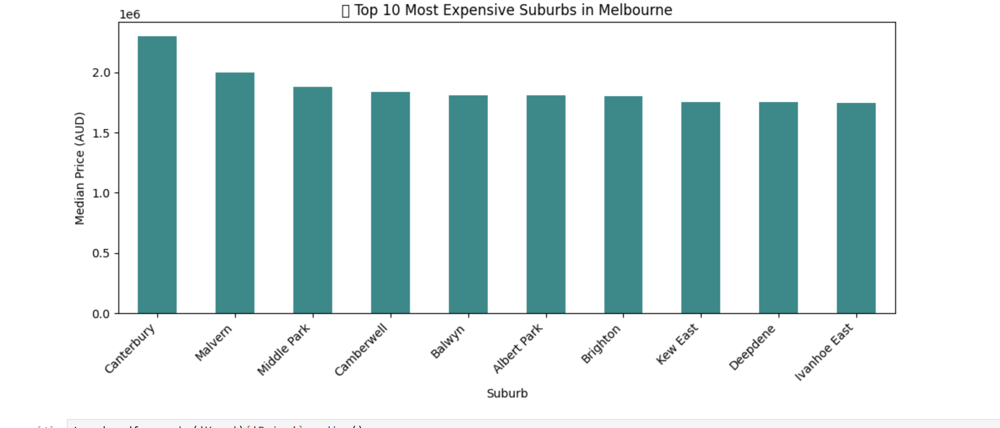
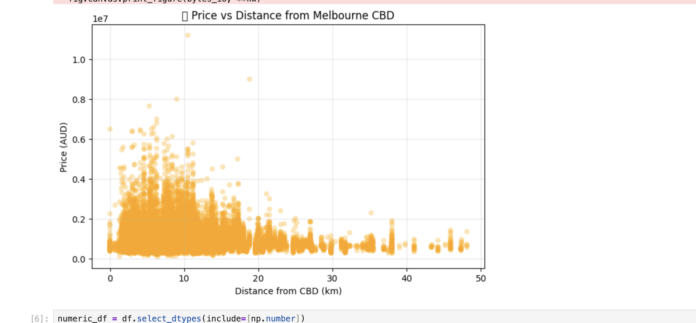
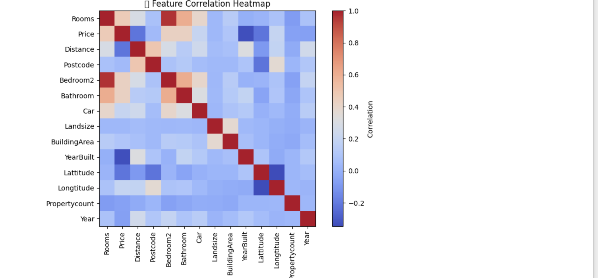

# 🏡 Melbourne Housing Dashboard

### 📊 Overview

This project presents an **interactive data analysis dashboard** of the Melbourne Housing Market, built entirely in **Python (Pyodide/Jupyter Notebook)** using `pandas` and `matplotlib`.  
It explores real-world property data — visualizing price trends, suburb comparisons, and correlations to help identify key housing insights for investors and analysts.

---

### 💾 Dataset

**Source:** [Melbourne Housing Market – Kaggle](https://www.kaggle.com/datasets/anthonypino/melbourne-housing-market)  
**File Used:** `Melbourne_housing_FULL.csv`

This dataset includes:

- 🏠 **Property Features:** Rooms, Bathrooms, Land Size, Building Area
- 📍 **Location Details:** Suburb, Region, Distance from CBD
- 💰 **Sale Info:** Price, Type, Method, Date of Sale
- 🗺️ **Additional Metadata:** Council Area, Coordinates, and Year Built

---

### ⚙️ Tech Stack

| Tool                 | Purpose                                                |
| -------------------- | ------------------------------------------------------ |
| **Python (Pyodide)** | Browser-based runtime for JupyterLite                  |
| **Pandas**           | Data cleaning and aggregation                          |
| **Matplotlib**       | Visualization (bar charts, scatter plots, trend lines) |
| **NumPy**            | Numerical computations                                 |

---

### 🧠 Key Insights

1. **Top Suburbs:** Visualizes the 10 most expensive suburbs in Melbourne based on median property prices.
2. **Price Trends:** Tracks median housing prices over time to identify growth or cooling phases.
3. **Distance Correlation:** Reveals that properties **closer to the Melbourne CBD** have significantly higher prices.
4. **Feature Correlations:** Displays a heatmap showing the strongest factors affecting price (e.g., rooms, land size, distance).

---

### 📈 Dashboard Snapshots

#### 🏙️ Most Expensive Suburbs

#### 📍 Price vs Distance from Melbourne CBD

#### 🔗 Feature Correlation Heatmap

---

### 🚀 How to Run

1. Download the dataset from [Kaggle](https://www.kaggle.com/datasets/anthonypino/melbourne-housing-market).
2. Upload `Melbourne_housing_FULL.csv` and the Jupyter Notebook file to your Jupyter environment.
3. Run the notebook cells sequentially.
4. All visuals will render automatically — no extra setup required.

---

### 🧾 Notebook Sections

| Section                | Description                                          |
| ---------------------- | ---------------------------------------------------- |
| 1️⃣ Import & Load Data  | Loads CSV and displays initial overview              |
| 2️⃣ Clean Data          | Handles missing values, converts date, extracts year |
| 3️⃣ Top Suburbs         | Median price comparison by suburb                    |
| 4️⃣ Price Trend         | Price changes over time                              |
| 5️⃣ Price vs Distance   | Scatterplot of price vs proximity to CBD             |
| 6️⃣ Correlation Heatmap | Visualizes feature correlations                      |
| 7️⃣ Summary Insights    | Prints analytical summary and findings               |

---

### 🔍 Author

**Towhidul Hassan**  
Computer Science Graduate | Data & AI Enthusiast  
📧 [LinkedIn](https://linkedin.com/in/towhidul-hassan)
